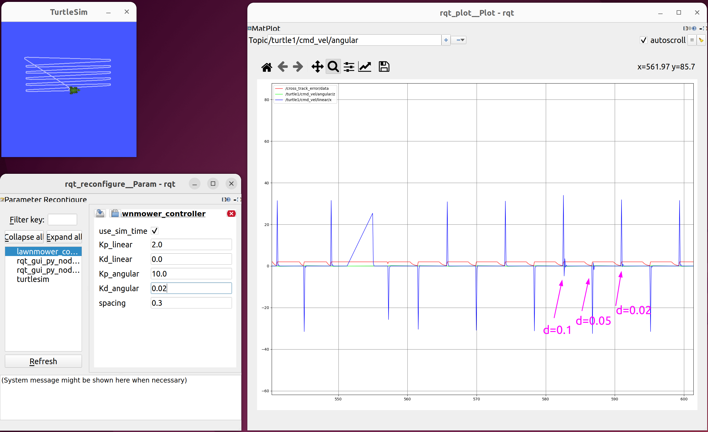
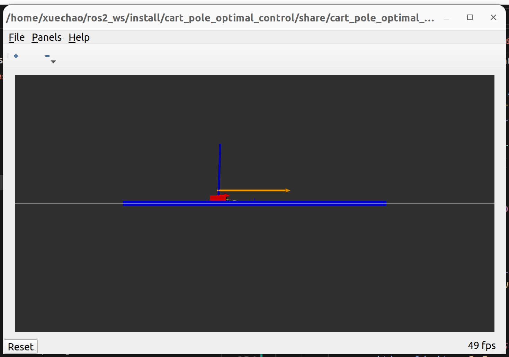

# Assignments for RAS-598 Space Robotics and AI 

> Course website: https://deepgis.org/dreamslab/ses598/

## Selected Results

### first_order_boustrophedon_navigator

### cart_pole_optimal_control

### terrain_mapping_drone_control

https://github.com/user-attachments/assets/55db56ef-00a0-4b15-8ca8-6aa5c5d2e106
