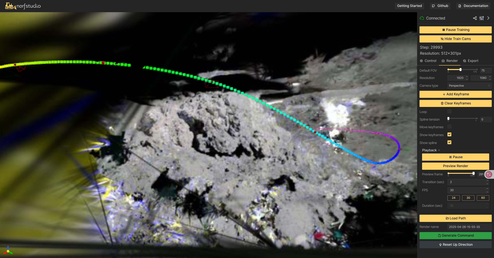

# Photogrammetry and Gaussian Splatting on Lunar Apollo 17 imagery

## Photogrammetry using Agisoft Metashape

- import images
    

- align images
    

- build model
    

- build texture
    

- export mesh
    

## Gaussian Splatting using NeRFStudio

```bash
ns-process-data images --data data/Apollo/images/ --output-dir data/Apollo/ns_preprocess/
ns-train splatfacto --data data/Apollo/ns_preprocess/
```




```
{
  "experiment_name": "Apollo",
  "method_name": "splatfacto",
  "checkpoint": "outputs/Apollo/splatfacto/2025-04-26_155533/nerfstudio_models/step-000029999.ckpt",
  "results": {
    "psnr": 14.06808853149414,
    "psnr_std": NaN,
    "ssim": 0.17576420307159424,
    "ssim_std": NaN,
    "lpips": 0.7293462753295898,
    "lpips_std": NaN,
    "num_rays_per_sec": 666877.125,
    "num_rays_per_sec_std": NaN,
    "fps": 0.48303812742233276,
    "fps_std": NaN
  }
}
```
