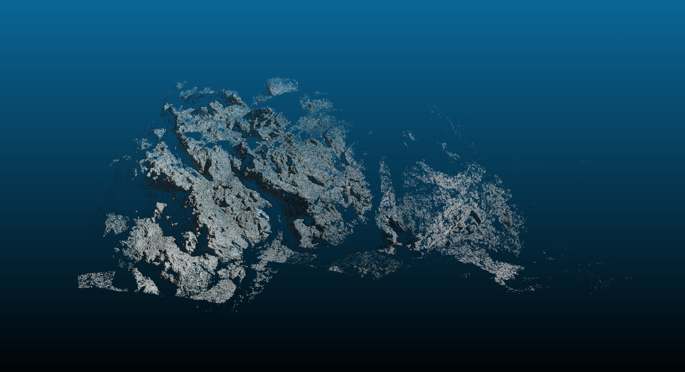

# Photogrammetry and Gaussian Splatting on Lunar Apollo 17 imagery

## Photogrammetry using Agisoft Metashape

First, use Agisoft Metashape software for photogrammetry, sequentially performing image alignment, model building, texture construction, and mesh export to obtain final results. Finally, visualize it in Meshlab, and the results were quite good.

- import images
    

- align images
    

- build model
    

- build texture
    

- export mesh
    

## Photogrammetry using COLMAP

Similarly, use COLMAP software for photogrammetry, with slightly worse results. Compared to Agisoft Metashape, it provides more adjustable parameters, but has a higher learning curve for beginners.

- feature matching
    

- dense reconstruction
    

- mesh model
    

- exported mesh
    


## Gaussian Splatting using NeRFStudio

Use NeRFStudio software for Gaussian splatting, with the entire training lasting about 30 minutes.

Looking at the results, the effect is good only in directions near the original viewpoint, while it's poor in other directions, especially with a lot of noise in the free space.

```bash
ns-process-data images --data data/Apollo/images/ --output-dir data/Apollo/ns_preprocess/
ns-train splatfacto --data data/Apollo/ns_preprocess/
ns-viewer --load-config outputs/Apollo/splatfacto/2025-04-26_155533/config.yml
ns-eval --load-config outputs/Apollo/splatfacto/2025-04-26_155533/config.yml
```


Numerically, the final PSNR is 14.068, SSIM is 0.175, and LPIPS is 0.729. PSNR is peak signal-to-noise ratio; a result of 14.068 indicates poor training effect. SSIM is structural similarity; a result of 0.175 also indicates poor training effect. This is probably due to the limited amount of training data.

```
{
  "experiment_name": "Apollo",
  "method_name": "splatfacto",
  "checkpoint": "outputs/Apollo/splatfacto/2025-04-26_155533/nerfstudio_models/step-000029999.ckpt",
  "results": {
    "psnr": 14.06808853149414,
    "psnr_std": NaN,
    "ssim": 0.17576420307159424,
    "ssim_std": NaN,
    "lpips": 0.7293462753295898,
    "lpips_std": NaN,
    "num_rays_per_sec": 666877.125,
    "num_rays_per_sec_std": NaN,
    "fps": 0.48303812742233276,
    "fps_std": NaN
  }
}
```

https://github.com/user-attachments/assets/66a71c87-0af8-48b5-a0f6-c0a31bcd969c

## Novel View Synthesis

Manually selected some new viewpoints, performed Novel View Synthesis, and added them to the original dataset.


## Enhanced Photogrammetry with Synthesized Views (N=25)

Use Agisoft Metashape to reconstruct the expanded dataset.


For quantitative evaluation of results:

- For 3D model comparison, since there is no ground truth model, we can try to evaluate through mesh topology complexity and density (number of faces and vertices).
- For 2D comparison, we can calculate the texture reprojection error to evaluate whether the final model faithfully reproduces the original images.


Use CloudCompare to align the original model and the final model. As a result, the number of effective faces and vertices did increase (151k -> 162k faces, 75k -> 81k vertices), but because Gaussian splatting fundamentally doesn't add new information essentially, the final model effect didn't improve significantly. In fact, due to the addition of noise from new viewpoints, the final model quality deteriorated in some areas, and texture reprojection error noticeably increased.
