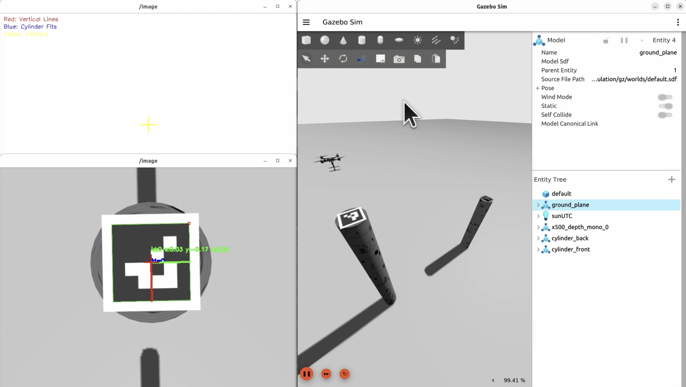

# Assignment 3: Rocky Times Challenge - Search, Map, & Analyze

This ROS2 package implements an autonomous drone system for geological feature detection, mapping, and analysis using an RGBD camera and PX4 SITL simulation.

## Challenge Overview

Students will develop a controller for a PX4-powered drone to efficiently search, map, and analyze cylindrical rock formations in an unknown environment. The drone must identify two rock formations (10m and 7m tall cylinders), estimate their dimensions, and successfully land on top of the taller cylinder.

### Mission Objectives
1. Search and locate all cylindrical rock formations
2. Map and analyze rock dimensions:
   - Estimate height and diameter of each cylinder
   - Determine positions in the world frame
3. Land safely on top of the taller cylinder
4. Complete mission while logging time and energy performance. 


### Evaluation Criteria (100 points)

The assignment will be evaluated based on:
- Total time taken to complete the mission
- Total energy units consumed during operation
- Accuracy of cylinder dimension estimates
- Landing precision on the taller cylinder
- Performance across multiple trials (10 known + 5 unknown scenes)

### Key Requirements

- Autonomous takeoff and search strategy implementation
- Real-time cylinder detection and dimension estimation
- Energy-conscious path planning
- Safe and precise landing on the target cylinder
- Robust performance across different scenarios

## Prerequisites

- ROS2 Humble
- PX4 SITL Simulator (Tested with PX4-Autopilot main branch 9ac03f03eb)
- RTAB-Map ROS2 package
- OpenCV
- Python 3.8+

## Repository Setup

### If you already have a fork of the course repository:

```bash
# Navigate to your local copy of the repository
cd ~/RAS-SES-598-Space-Robotics-and-AI

# Add the original repository as upstream (if not already done)
git remote add upstream https://github.com/DREAMS-lab/RAS-SES-598-Space-Robotics-and-AI.git

# Fetch the latest changes from upstream
git fetch upstream

# Checkout your main branch
git checkout main

# Merge upstream changes
git merge upstream/main

# Push the updates to your fork
git push origin main
```

### If you don't have a fork yet:

1. Fork the course repository:
   - Visit: https://github.com/DREAMS-lab/RAS-SES-598-Space-Robotics-and-AI
   - Click "Fork" in the top-right corner
   - Select your GitHub account as the destination

2. Clone your fork:
```bash
cd ~/
git clone https://github.com/YOUR_USERNAME/RAS-SES-598-Space-Robotics-and-AI.git
```

### Create Symlink to ROS2 Workspace

```bash
# Create symlink in your ROS2 workspace
cd ~/ros2_ws/src
ln -s ~/RAS-SES-598-Space-Robotics-and-AI/assignments/terrain_mapping_drone_control .
```

### Copy PX4 Model Files

Copy the custom PX4 model files to the PX4-Autopilot folder

```bash
# Navigate to the package
cd ~/ros2_ws/src/terrain_mapping_drone_control

# Make the setup script executable
chmod +x scripts/deploy_px4_model.sh

# Run the setup script to copy model files
./scripts/deploy_px4_model.sh -p /path/to/PX4-Autopilot
```

## Building and Running

```bash
# Build the package
cd ~/ros2_ws
colcon build --packages-select terrain_mapping_drone_control --symlink-install

# Source the workspace
source install/setup.bash

# Launch the simulation with visualization with your PX4-Autopilot path
ros2 launch terrain_mapping_drone_control cylinder_landing.launch.py

# OR you can change the default path in the launch file
        DeclareLaunchArgument(
            'px4_autopilot_path',
            default_value=os.environ.get('HOME', '/home/' + os.environ.get('USER', 'user')) + '/PX4-Autopilot',
            description='Path to PX4-Autopilot directory'),
```
## Extra credit -- 3D reconstruction (50 points)
Use RTAB-Map or a SLAM ecosystem of your choice to map both rocks, and export the world as a mesh file, and upload to your repo. Use git large file system (LFS) if needed. 

## License

This assignment is licensed under the Creative Commons Attribution-NonCommercial-ShareAlike 4.0 International License (CC BY-NC-SA 4.0). 
For more details: https://creativecommons.org/licenses/by-nc-sa/4.0/ 


# Assignment Submission

Xuechao Zhang, Mar. 25th

<!-- [](resource/Full%20Process%20Demonstration.mp4 "Full Process Demonstration") -->

https://github.com/user-attachments/assets/55db56ef-00a0-4b15-8ca8-6aa5c5d2e106

## Start Script

For developing and debugging purposes, nodes are started separately.

```bash
# Start the Micro XRCE-DDS Agent
MicroXRCEAgent udp4 -p 8888

# Start QGroundControl
./QGroundControl.AppImage

# Start the simulation
ros2 launch terrain_mapping_drone_control cylinder_landing.launch.py

# Start the geometry tracker
python3 geometry_tracker.py
ros2 run image_view image_view image:=/geometry/debug_image

# Start the aruco tracker
python3 aruco_tracker.py
ros2 run image_view image_view image:=/aruco/debug_image

# Start the cylinder landing node
python3 cylinder_landing_node.py

```

## Development Notes

### State Machine


The autonomous landing task is divided into the following sequential state machine:

1. TAKEOFF
   - Execute `self.engage_offboard_mode()` to switch to offboard mode, enabling takeoff commands
   - Execute `self.arm()` to unlock the drone
   - Take off from origin to 5m altitude, completing initialization steps

2. SEARCH
   - Slowly increase altitude while rotating at a fixed angular velocity
   - Use Geometry Tracker node to search for potential cylinders
   - Store detected cylinders in a dictionary: `self.cylinder_position[yaw] = [distance, current_height, last_seen_cycle_count]`
   - Specifically, establish a polar coordinate system with the drone's current position as origin, using yaw as the key() for each cylinder
   - When detecting new cylinders in the image, use yaw angle proximity to determine whether to update existing cylinders or add new ones
   - The exit condition: when only one cylinder is visible during a complete rotation, the drone assumes it has found the target highest cylinder

3. CLIMB
   - Control the drone to face the target yaw angle
   - Gradually increase altitude while adding zero-mean random noise to yaw to prevent detection failures
   - Calculate the cylinder's final height when its top is detected, then proceed to the next step

4. APPROACH
   - Navigate the drone 1.5m directly above the target cylinder in preparation for landing

5. LAND
   - Utilize the drone's downward-facing camera for Aruco Tag tracking and positioning
   - Activate the Aruco Tracker node's callback function, transform tag position from camera coordinates to world coordinates
   - Implement closed-loop landing using tag spatial positioning

### Challenges

This was my first experience with drone systems and their environment (QGroundControl and PX4 SITL), requiring significant time to configure the environment and debug inter-module communications.

Since drone yaw angles range from -π to π, boundary handling was necessary for proximity detection and angle calculations.

PX4 uses the NED (North-East-Down) coordinate system, which is unusual and required special attention.

The default Aruco Tracker parameters weren't robust, frequently missing detections. This was resolved by adding `image = cv2.bilateralFilter(image, 9, 75, 75)` as a preprocessing step to enhance detection reliability.

Due to time constraints, many parameters remain to be optimized.
